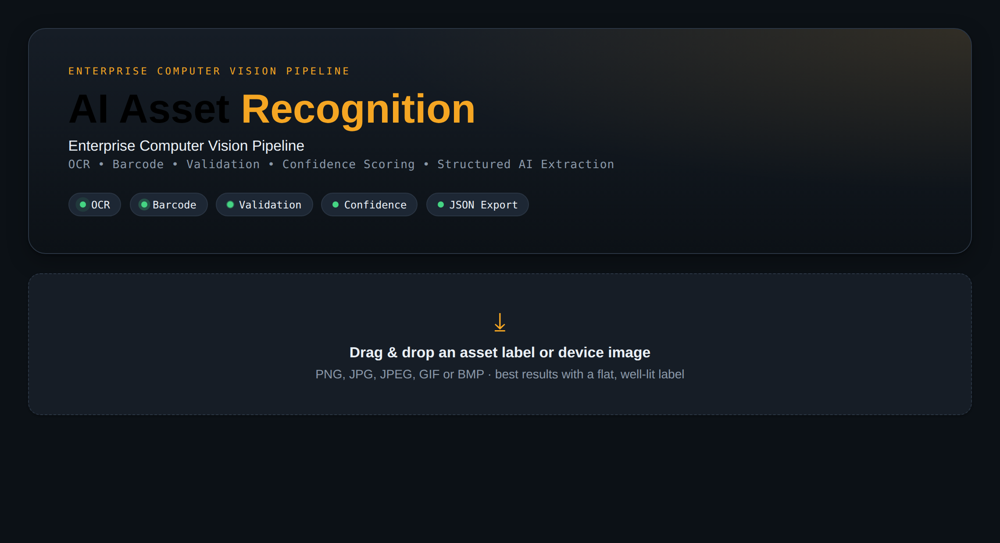
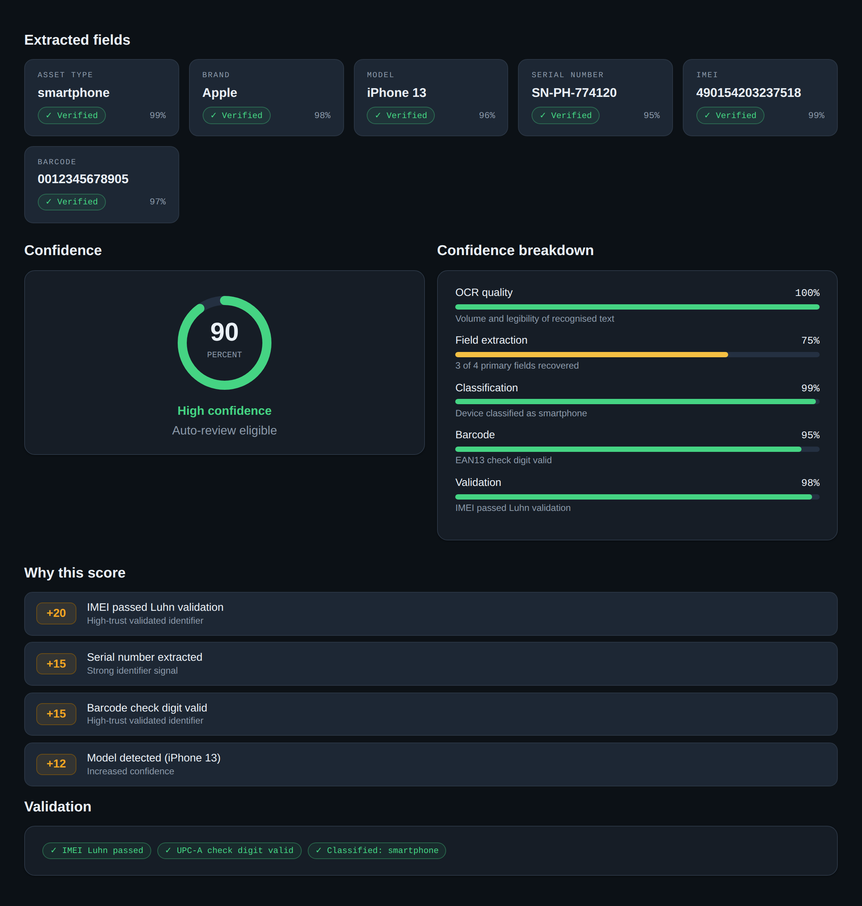
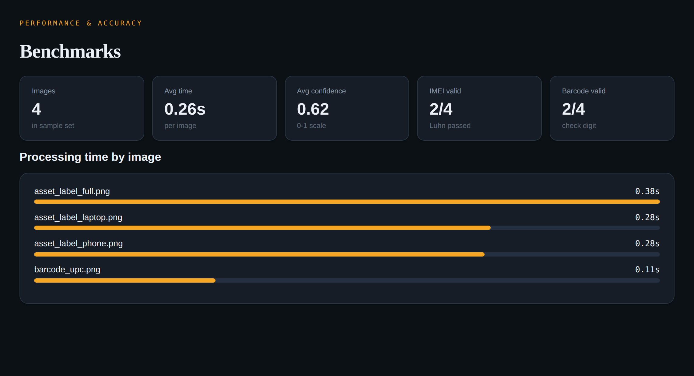

<div align="center">

# AI Asset Recognition

### Enterprise Computer Vision Pipeline

**OCR • Barcode • Validation • Confidence Scoring • Structured AI Extraction**

[](https://github.com/shrenik355/AI-Asset-Recognition-Portfolio/actions/workflows/python-tests.yml)


Turn a photo of a device label into structured, validated, confidence-scored asset data — with the reasoning shown, never hidden.

</div>

---

## Overview

AI Asset Recognition is an end-to-end computer-vision pipeline that reads an
asset/device label, decodes its barcode, validates the identifiers against their
published checksums, and returns a single transparent confidence score plus a
review recommendation. It ships as a polished multi-page Streamlit application
with a benchmark harness, unit tests, and CI.



---

## Why it exists

Organisations that intake large volumes of electronic assets still lean on manual
data entry — slow, error-prone, and with no signal for *which* records need a
human's attention. This project automates the read-and-validate step and, more
importantly, **triages**: high-confidence records flow through, low-confidence
ones get flagged.

---

## Key features

- **OCR text extraction** from label images (Tesseract).
- **Barcode decoding** for UPC-A / EAN-13 (pyzbar).
- **Two-tier field extraction** — labelled `Key: Value` patterns with a keyword
  fallback for unstructured captures.
- **Standards-based validation** — IMEI via Luhn; barcodes via their GS1 check digit.
- **Explainable confidence scoring** — a transparent weighted score, a per-component
  breakdown, and weighted explanation cards.
- **OCR bounding-box overlay** on the source image.
- **Structured export** — JSON (syntax-highlighted) and CSV.
- **Multi-page app** — Dashboard, Architecture, Benchmarks, Documentation, API, About.
- **Bonus UX** — animated pipeline progress, recent-scan history, demo mode, settings toggles.

---

## Result view

Extracted-field cards with per-field confidence and verification, a circular
confidence gauge, a component breakdown, weighted "why this score" cards, and
validation chips:



---

## Benchmarks



A reproducible harness measures per-image timing and extraction/validation success:

```bash
python benchmark/run_benchmark.py
```

Methodology and full numbers in [`docs/benchmark_report.md`](docs/benchmark_report.md).

---

## Architecture

```
image ─▶ preprocessing ─▶ OCR ─▶ barcode ─▶ field extraction ─▶ validation ─▶ confidence ─▶ JSON ─▶ dashboard
```

Each stage is an independent, typed module with a single responsibility. The app,
the analytics layer, and the benchmark harness all consume one shared pipeline
entry point. Full detail in [`docs/architecture.md`](docs/architecture.md).

---

## Tech stack

| Area         | Tools                            |
|--------------|----------------------------------|
| Language     | Python 3.10+                     |
| OCR          | Tesseract · pytesseract          |
| Barcode      | pyzbar (zbar)                    |
| Imaging      | Pillow                           |
| Web app      | Streamlit (custom design system) |
| Data / charts| pandas                           |
| Testing / CI | pytest · GitHub Actions          |

---

## Installation

```bash
# System dependencies
sudo apt-get install -y tesseract-ocr libzbar0      # Ubuntu/Debian
brew install tesseract zbar                          # macOS

# Project
git clone https://github.com/shrenik355/AI-Asset-Recognition-Portfolio.git
cd AI-Asset-Recognition-Portfolio
pip install -r requirements.txt
```

On Windows, install Tesseract and set `TESSERACT_CMD` to its path.

---

## Usage

```bash
# Launch the multi-page app
streamlit run app/streamlit_app.py

# Use the pipeline directly
python -c "from src.pipeline import process_path; print(process_path('data/sample_images/asset_label_full.png').to_json())"

# Regenerate samples / screenshots (optional)
python data/generate_samples.py
python docs/generate_screenshots.py
```

---

## Sample output

```json
{
  "asset_type": "smartphone",
  "brand": "Apple",
  "model": "iPhone 13",
  "serial_number": "SN-PH-774120",
  "asset_tag": null,
  "imei": "490154203237518",
  "imei_valid": true,
  "barcode": "012345678905",
  "barcode_type": "UPC-A",
  "barcode_valid": true,
  "confidence_score": 0.9,
  "review_recommendation": "Auto-review eligible",
  "explanation": [
    "Brand identified (Apple).",
    "Model identified (iPhone 13).",
    "IMEI passed Luhn validation.",
    "Barcode decoded and check digit is valid."
  ]
}
```

---

## Confidence scoring

A transparent weighted sum of evidence signals, clamped to 0–1. Validated
identifiers outweigh merely present ones, and every score ships with its reasoning.

| Score range | Recommendation             |
|-------------|----------------------------|
| 0.85 – 1.00 | Auto-review eligible       |
| 0.60 – 0.84 | Human review recommended   |
| 0.00 – 0.59 | Manual review required     |

Full weight table in [`docs/confidence_scoring.md`](docs/confidence_scoring.md).

---

## Project structure

```
AI-Asset-Recognition-Portfolio/
├── app/
│   ├── streamlit_app.py        # Dashboard (entry point)
│   ├── theme.py                # Design system + components
│   └── pages/                  # Architecture · Benchmarks · Docs · API · About
├── src/
│   ├── ocr.py  barcode.py  extractor.py
│   ├── validation.py  confidence.py
│   ├── analytics.py            # Derived UI views (non-breaking)
│   ├── pipeline.py  utils.py
├── data/
│   ├── sample_images/  sample_outputs/
│   └── generate_samples.py
├── docs/
│   ├── architecture.md  confidence_scoring.md  validation_rules.md
│   ├── benchmark_report.md  limitations.md
│   ├── screenshots/            # Generated PNGs
│   └── generate_screenshots.py
├── tests/                      # 40 unit tests
├── benchmark/                  # Timing harness + CSV
├── .github/workflows/          # CI
└── requirements.txt
```

---

## Testing

```bash
pytest tests/ -v   # 40 tests: Luhn, UPC-A/EAN-13, confidence, extraction
```

CI runs the suite on Python 3.10, 3.11, and 3.12 on every push.

---

## Roadmap

- Image pre-processing (deskew, threshold, denoise) ahead of OCR.
- Hybrid extraction — a learned extractor behind the deterministic rules.
- Calibrated confidence fit against a labelled ground-truth dataset.
- Broader symbology support (QR, Code-128, Data Matrix).
- REST API + container for embedding in an intake workflow.

Full detail in [`docs/limitations.md`](docs/limitations.md).

---

## Disclaimer

This is an independent portfolio project built with public/sample data and
original code. It does not contain proprietary employer or client code.

## License

MIT — see [`LICENSE`](LICENSE).
